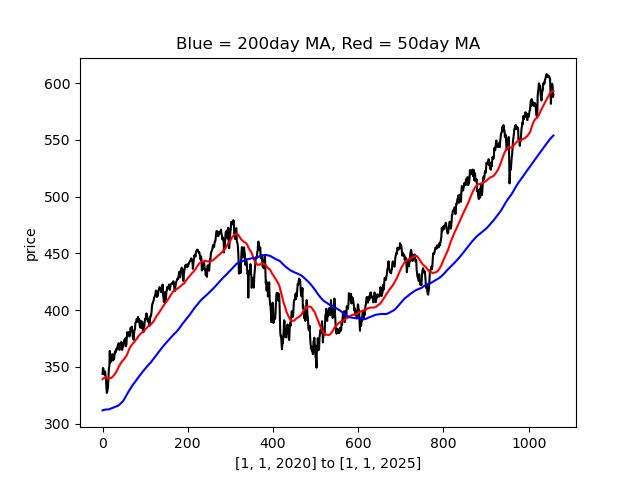

# Trading Bot

A simple backtesting framework for a moving average crossover trading strategy using Alpaca historical data.

Made in a modular fashion such that strategies can be added and tested with ease.

---

## Features

- **Data Gathering:**  
  Fetches historical stock data using the Alpaca API.
  `gather_data.py`

- **Strategy:**  
  Implements a simple moving average (SMA) crossover strategy. `simple_moving_average_crossover.py`

  Aiming to implement and test more strategies.

- **Backtesting:**  
  Simulates trades based on generated buy/sell signals. `main`

---

## Project Structure

```
trading_bot/
│
├── data/
│   └── gather_data.py
|   └── DATAFILES ...
├── strategies
│   └── simple_moving_average_crossover.py
|       └── sma_backtest.py
|       └── sma_strategy.py
│   └──  geometric_brownian_motion.py
|        └── gbm_strategy.py
├── .gitattributes
└── README.md
```

---

## Usage

1. **Set up Alpaca API keys**  
   Place your Alpaca API keys in a file named `alpaca_keys.txt` in the project root, formatted as expected by `gather_data.py`.

2. **Install dependencies**
   ```
   pip install numpy pandas matplotlib alpaca-py
   ```

3. **Run the bot**
    This will be improved such that inputs will be taken through CLI (using argparse)

---
## TO-DO

- Implement gbm strategy
- Make a main.py to run each via argparse
- Refine readme
- Consider bid/ask spreads
- Calculate metrics (Sharpe, win-rate, )

---

